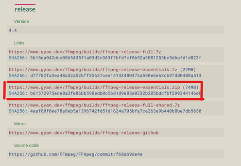
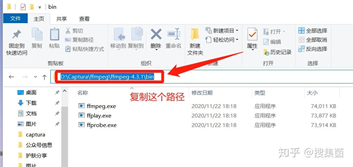
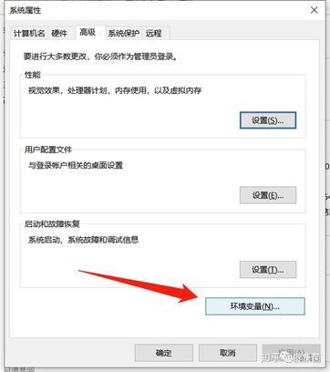
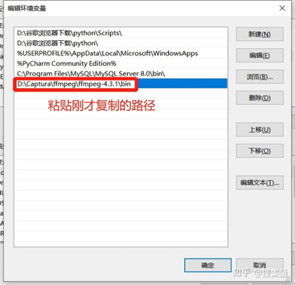
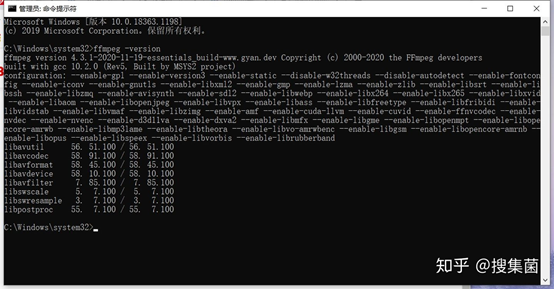
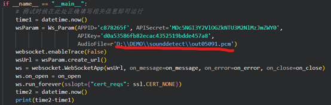
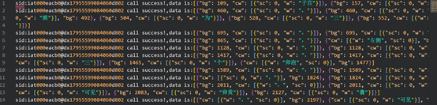
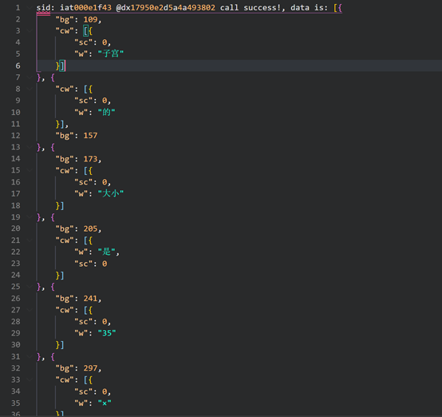

# DEMO实现

1、 环境配置
 本机环境：WINDOWS10
 编译环境：Python3.6.6
 开发环境：VScode

2、 外部工具

a)     FFmpeg
 FFmpeg官方网址——下载安装包
 https://www.gyan.dev/ffmpeg/builds/



b)     解压后配置环境变量

 将解压后的bin目录复制到环境变量中

  



c)     在CMD中执行“ffmpeg –version”出现下图即成功。
  

3、 文件格式转换
 使用FFmpeg进行转换
 **下面以****MP3****文件为例**
 首先将MP3格式转换为wav文件
 ffmpeg -i input.mp3 -acodec pcm_s16le -ac 1 -ar 8000 output.wav
 再将wav文件转换为pcm文件
 ffmpeg -i output.wav -f s16le -ar 16000 -acodec pcm_s16le output.pcm

4、 配置APPID、APISecret、APIKey
  

5、 修改文件地址
  

6、 输出json字串
  

7、 格式化文档
  

8、 进行字串的提取

# 讯飞开放平台语音识别音频文件格式说明

讯飞语音能力一般情况下支持如下音频格式：

1. pcm（pcm_s16le），wav，speex(speex-wb)
2. 采样率为16000 或者 8000. 推荐使用16000，比特率为16bit
3. 单声道

## [#](https://www.xfyun.cn/doc/asr/voicedictation/Audio.html#音频文件格式转换工具ffmpeg)音频文件格式转换工具ffmpeg

### [#](https://www.xfyun.cn/doc/asr/voicedictation/Audio.html#简介)简介

FFmpeg是一套可以用来记录、转换数字音频、视频，并能将其转化为流的开源计算机程序。 详情可参考：http://ffmpeg.org/

### [#](https://www.xfyun.cn/doc/asr/voicedictation/Audio.html#示例)示例

Mp3 转换为 16k 16bit 单声道 pcm

```text
ffmpeg -y -i test.mp3 -acodec pcm_s16le -f s16le -ac 1 -ar 16000 test.pcm
```

wav 转换为 16k 16bit 单声道 pcm

```text
ffmpeg -y -i test.wav -acodec pcm_s16le -f s16le -ac 1 -ar 16000 test.pcm
```

44100,16bit,单声道pcm 转换为 16k 16bit 单声道 pcm

```text
ffmpeg -y -f s16le -ar 44100 -ac 1 -i test.pcm -acodec pcm_s16le -f s16le -ac 1 -ar 16000 test.pcm
```

参数解释：

-y： 表示无需询问,直接覆盖输出文件;

-acodec： 用于设置音频的编码器和解码器；

-f s16le： 用于设置文件格式为 s16le;

-ar 16000： 用于设置音频采样频率为 16k;

-ac 1： 用于设置通道数为 1;

-i： 用于设置输入文件；

## [#](https://www.xfyun.cn/doc/asr/voicedictation/Audio.html#speex编码)speex编码

讯飞开放平台rest_api支持speex编码压缩音频文件，相较于PCM可以节约网络传输成本，推荐使用speex格式。
请注意压缩前的原始音频文件，必须为采样率16K、16bits、单声道的PCM格式。

接口支持标准开源speex编码（speex-size参数必传）和讯飞定制speex编码（讯飞定制speex，无需额外传speex-size参数）

说明：

1. 标准开源speex编解码，需下载编译speex库。详情可参考：https://www.speex.org/
2. 标准开源speex格式，speex_size与speex库压缩等级（quantity）关系表如下：

| quantity（压缩等级）      | 0    | 1    | 2    | 3    | 4    | 5    | 6    | 7    | 8    | 9    | 10   |
| :------------------------ | :--- | :--- | :--- | :--- | :--- | :--- | :--- | :--- | :--- | :--- | :--- |
| speex_size（speex）8k     | 6    | 10   | 15   | 20   | 20   | 28   | 28   | 38   | 38   | 46   | 62   |
| speex_size（speex-wb）16k | 10   | 15   | 20   | 25   | 32   | 42   | 52   | 60   | 70   | 86   | 106  |

1. 讯飞定制编解码工具下载（[点击下载 ](https://xfyun-doc.cn-bj.ufileos.com/1551681433530034/speex_tools.zip)）,使用讯飞定制编码时，无需传speex_size参数

